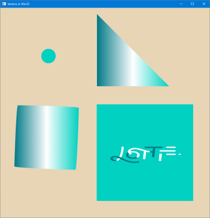

# Introduction to using vector animation in a Win32 client app

This sample demonstrates the use of the Universal Windows Platform (UWP) [Visual Layer](https://docs.microsoft.com/windows/uwp/composition/visual-layer) APIs ([Windows.UI.Composition](https://docs.microsoft.com/uwp/api/windows.ui.composition)) in a native Win32 C++ App.

The Visual Layer APIs provide a high performance, retained-mode API for graphics, effects, and animations. It's the recommended replacement for DirectComposition in apps that run on Windows 10.

This sample demonstrates how to create a Win32 window using C++/WinRT, then add and animate vector shapes.

## Features

This sample includes the following features:

- Scenario 1: Create a simple [ShapeVisual](https://docs.microsoft.com/uwp/api/windows.ui.composition.shapevisual).
- Scenario 2: Create a simple path using [CompositionPath](https://docs.microsoft.com/uwp/api/windows.ui.composition.compositionpath), Direct2D, and ShapeVisual.
- Scenario 3: Create a morph animation using ShapeVisual, two CompositionPaths, and an animated [CompositionPathGeometry](https://docs.microsoft.com/uwp/api/windows.ui.composition.compositionpathgeometry).
- Scenario 4: Play vector animation output from the [LottieViewer](https://www.microsoft.com/store/productId/9P7X9K692TMW) tool.

## Run the sample

This sample requires:

- Visual Studio 2022 or later - [Get a free copy of Visual Studio with support for building Universal Windows apps](http://go.microsoft.com/fwlink/?LinkID=280676)
- Windows 10 version 1803 or later
- Windows 10 SDK 17134 or later

## Known issues

Scenario 4 uses the [Windows UI Library](https://aka.ms/winui-docs). If you get an error while compiling the project, follow these 2 steps to make scenario 4 work:
- [Install the pre-release Microsoft.UI.Xaml package 190131001-prerelease](https://www.nuget.org/packages/Microsoft.UI.Xaml/2.1.190131001-prerelease)
- Edit `HelloVectors\packages\Microsoft.UI.Xaml.2.1.190131001-prerelease\build\native\Microsoft.UI.Xaml.targets` and replace `<ItemGroup Condition="'$(TargetPlatformIdentifier)' == 'UAP'">` with `<ItemGroup>`.

## See also

[Visual Layer documentation](https://docs.microsoft.com/windows/uwp/composition/visual-layer)

API reference: [Windows.UI.Composition](https://docs.microsoft.com/uwp/api/windows.ui.composition)
