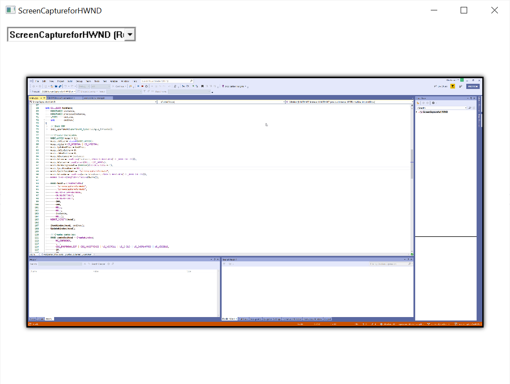

# Screen capture for HWND

This sample demonstrates how to use the Windows.Graphics.Capture APIs in a Win32 application.

> NOTE: Minimized windows are enumerated, but not captured.

## Run the sample

This sample requires:

- Visual Studio 2022 or later - [Get a free copy of Visual Studio](http://go.microsoft.com/fwlink/?LinkID=280676)
- Windows 10 version 1903 or later
- Windows 10 SDK 18362 or later - [Get the SDK](https://developer.microsoft.com/windows/downloads/windows-10-sdk)

## Code at a glance

This sample uses new APIs available in Windows 10, version 1903 (SDK 18362) or later.

- `CreateForWindow` (HMON) APIs are in the Windows.Graphics.Capture.Interop.h header.

### Win32 vs UWP

For the most part, using the API is the same between Win32 and UWP. However, there are some small differences.

1. The `GraphicsCapturePicker` won't be able to infer your window in Win32, so you'll have to provide your window's HWND.
2. `Direct3D11CaptureFramePool` requires a `DispatcherQueue` much like the Composition APIs. You'll need to create a dispatcher for your thread.

## See also

[Windows.Graphics.Capture Namespace](https://docs.microsoft.com/uwp/api/windows.graphics.capture)
