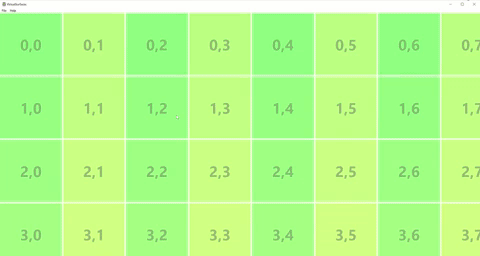

# Virtual Surface in Native C++

An example app user interface (UI) that demonstrates the use of the Universal Windows Platform (UWP) [Visual Layer](https://docs.microsoft.com/windows/uwp/composition/visual-layer) APIs ([Windows.UI.Composition](https://docs.microsoft.com/uwp/api/windows.ui.composition)) in a native Win32 C++ App.

The Visual Layer APIs provide a high performance, retained-mode API for graphics, effects, and animations. It's the recommended replacement for DirectComposition in apps that run on Windows 10.

This sample demonstrates how to use Virtual Surfaces and Interaction Tracker that helps create a smooth scrollable surface that responds well to touch, mouse and precision touchpad. We use a tile based approach to show how the tiles are only loaded on a need based, depending on user interaction. Content outside this area is trimmed, to keep the memory consumption down especially when working with large surfaces.
Developers creating document/canvas editing experiences will benefit with this sample and the concepts explained in it.

For an introduction to hosting Visual Layer APIs in a native win32 app, see the **Using the Visual Layer with Win32** [tutorial](https://docs.microsoft.com/windows/uwp/composition/using-the-visual-layer-with-win32) and [sample](https://github.com/Microsoft/Windows.UI.Composition-Win32-Samples/tree/master/cpp/HelloComposition). This sample builds on the code introduced there.

## Features

This sample includes the following features:

- Creating a DesktopWindow render target inside a child HWND.
- A full-on Composition Visual Tree inside this render target.
- A Composition Virtual Surface that can host native content(Direct2D & DirectWrite in this case). 
- Showcases a canvas of size 250000*250000, that is rendered smoothly as the user navigates in it.
- Use of InteractionTracker and Expression animations to manipulate the content.
- Content rendering using Direct2D and DirectWrite and how it interops with Windows.UI.Composition.

## Run the sample

This sample requires:

- Visual Studio 2022 or later - [Get a free copy of Visual Studio](http://go.microsoft.com/fwlink/?LinkID=280676)
- Windows 10 version 1903 or later
- Windows 10 SDK 18362 or later - [Get the SDK](https://developer.microsoft.com/windows/downloads/windows-10-sdk)

## Limitations

While many Visual Layer features work the same when hosted in a win32 app as they do in a UWP app, some features do have limitations. Here are some of the limitations to be aware of:

- InteractionTracker does not work well with the top-level HWND, hence a child hwnd need to be created if we plan to use InteractionTracker for content manipulation.
- To do hit testing, you need to do bounds calculations by walking the visual tree yourself. This is the same as the Visual Layer in UWP, except in this case there's no XAML element you can easily bind to for hit testing. 
- The Visual Layer does not have a primitive for rendering text. This sample uses the DirectWrite to render text to a surface.

## See also

We've covered a small subset of Windows Composition features that can be easily integrated into your existing or new win32 app. There are still many others, such as shadows, more animation types, perspective transforms, and so forth. For an overview of other Composition features and the benefits they can bring to your applications, see the [Visual Layer documentation](https://docs.microsoft.com/windows/uwp/composition/visual-layer).

API reference: [Windows.UI.Composition](https://docs.microsoft.com/uwp/api/windows.ui.composition)