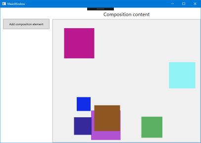

# WPF HelloComposition sample

This sample contains the code created in the [Using the Visual Layer with WPF](https://docs.microsoft.com/windows/uwp/composition/using-the-visual-layer-with-wpf) tutorial. It's a simple user interface (UI) that demonstrates how to add Universal Windows Platform (UWP) [Visual Layer](https://docs.microsoft.com/windows/uwp/composition/visual-layer) content to a Windows Presentation Foundation (WPF) app.

The Visual Layer APIs provide a high performance, retained-mode API for graphics, effects, and animations. It's the recommended  replacement for DirectComposition in apps that run on Windows 10.

This sample demonstrates how to set up the interop code needed to use these APIs in a WPF app.

## Features

This sample includes the following features:

- A WPF host class that implements HwndHost.
- Use of PInvoke and COM interop to access additional platform APIs.
- Encapsulation of the Visual Layer content in a WPF UserControl.
- Simple use of Composition visuals, brushes, and animations.

## Run the sample

This sample requires:

- Visual Studio 2017 or later - [Get a free copy of Visual Studio](http://go.microsoft.com/fwlink/?LinkID=280676)
- .NET Framework 4.7.2 or later
- Windows 10 version 1803 or later
- Windows 10 SDK 17134 or later

## Code at a glance

### CompositionHost

The main feature of this sample is the **CompositionHost** class, which derives from [HwndHost](https://docs.microsoft.com/dotnet/api/system.windows.interop.hwndhost) and contains the code to set up interop between WPF and the UWP Visual Layer.

The [Create an HwndHost derived class to host composition elements](https://docs.microsoft.com/windows/uwp/composition/using-the-visual-layer-with-wpf#create-an-hwndhost-derived-class-to-host-composition-elements) section of the tutorial that accompanies this sample walks through the setup step-by-step. However, you can copy-and-paste the code into a WPF project and use it as-is; none of the code in this file is specific to this sample (except the namespace).

### CompositionHostControl

The **CompositionHostControl** class demonstrates how to use a WPF UserControl to package your Visual Layer content in a way that you can easily integrate with your XAML UI.

See the [Create a UserControl to add your content to the WPF visual tree](https://docs.microsoft.com/windows/uwp/composition/using-the-visual-layer-with-wpf#create-a-usercontrol-to-add-your-content-to-the-wpf-visual-tree) section of the tutorial for more info about creating a container for Visual Layer content and connecting it to a XAML host element.

### MainWindow

In MainWindow.xaml, you can see how to add an instance of **CompositionHostControl** to your XAML UI.

See the [Add the user control to your XAML page](https://docs.microsoft.com/windows/uwp/composition/using-the-visual-layer-with-wpf#add-the-user-control-to-your-xaml-page) section of the tutorial for more info.

## See also

For a more complete example that builds on this infrastructure, see the [WPF Visual layer integration sample](https://github.com/Microsoft/Windows.UI.Composition-Win32-Samples/tree/master/dotnet/WPF/VisualLayerIntegration).

- [Visual Layer documentation](https://docs.microsoft.com/windows/uwp/composition/visual-layer)
- [Windows.UI.Composition](https://docs.microsoft.com/uwp/api/windows.ui.composition)