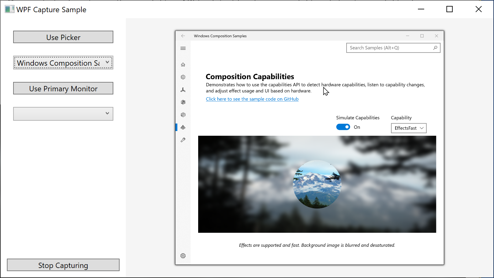

# WPF Screen Capture

This sample demonstrates how to use [Windows.Graphics.Capture](https://docs.microsoft.com/uwp/api/windows.graphics.capture) APIs for displays and windows in a WPF app. It also shows how to launch the system picker, which can manage window enumeration and capture selection for you.

 

> NOTE: Minimized windows are enumerated but not captured.

## Run the sample

- Visual Studio 2017 or later - [Get a free copy of Visual Studio](http://go.microsoft.com/fwlink/?LinkID=280676)
- .NET Framework 4.7.2 or later
- Windows 10 version 1903 or later
- Windows 10 SDK 18362 or later - [Get the SDK](https://developer.microsoft.com/windows/downloads/windows-10-sdk)

## Code at at glance

This sample uses new APIs available in Windows 10 version 1903, SDK 18362:

 - `CreateForWindow` (HWND) and `CreateForMonitor` (HMON) APIs are in the Windows.Graphics.Capture.Interop.h header.

## See also

[Main ReadMe for this repo](https://github.com/Microsoft/Windows.UI.Composition-Win32-Samples)

API reference: [Windows.Graphics.Capture Namespace](https://docs.microsoft.com/uwp/api/windows.graphics.capture)
