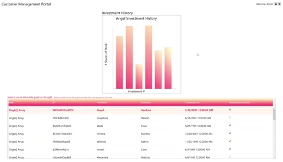

# WPF Visual Layer Integration sample

An example app user interface (UI) that demonstrates the use of the Universal Windows Platform (UWP) [Visual Layer](https://docs.microsoft.com/windows/uwp/composition/visual-layer) APIs ([Windows.UI.Composition](https://docs.microsoft.com/uwp/api/windows.ui.composition)) in a Windows Presentation Foundation (WPF) app.

The Visual Layer APIs provide a high performance, retained-mode API for graphics, effects, and animations. It's the recommended  replacement for DirectComposition in apps that run on Windows 10.

This sample demonstrates how to use these APIs to enhance an existing WPF app UI. We use UWP hosting APIs to add a bar graph to a WPF app and show a visual representation of data selected in a DataGrid.



For an introduction to hosting Visual Layer APIs in a WPF app, see the **Using the Visual Layer with WPF** [tutorial](https://docs.microsoft.com/windows/uwp/composition/using-the-visual-layer-with-wpf) and [sample](https://github.com/Microsoft/Windows.UI.Composition-Win32-Samples/tree/master/dotnet/WPF/HelloComposition). This sample builds on the code introduced there.

## Features

This sample includes the following features:

- A WPF host class that implements HwndHost.
- Use of PInvoke and COM interop to access additional platform APIs.
- A custom graph class and associated helpers.
- Use of Composition APIs and animations to enhance look & feel - including Implicit animation, Lights, and Shapes.
- Text rendering using SharpDX

## Run the sample

This sample requires:

- Visual Studio 2017 or later - [Get a free copy of Visual Studio](http://go.microsoft.com/fwlink/?LinkID=280676)
- .NET Framework 4.7.2 or later
- Windows 10 version 1803 or later
- Windows 10 SDK 17134 or later

## Code at a glance

### Composition features

The code that makes use of the Visual Layer is located in the _BarGraphUtilities_ folder. Once the interop between the UWP Visual Layer and the desktop app is set up, using the Visual Layer in WPF is much like using it in UWP. We demonstrate several common composition features to enhance the UI, and the code to implement the bar graph is essentially the same code you would use in a UWP app.

#### Visuals and shapes

[ShapeVisuals](https://docs.microsoft.com/uwp/api/windows.ui.composition.shapevisual) are easily integrated into the hosted visual tree.  

See the _CreateBar_ method in **Bar.cs** for an example of code that creates a shape subtree and attaches it to the main visual tree.

```csharp
// Define shape visual for bar outline.
shapeOutlineVisual = compositor.CreateShapeVisual();
 ...
// Create geometry and shape for the bar outline.
rectOutlineGeometry = compositor.CreateRectangleGeometry();
var barOutlineVisual = compositor.CreateSpriteShape(rectOutlineGeometry);
...
shapeOutlineVisual.Shapes.Add(barOutlineVisual);
...
```

#### Brushes

[CompositionBrushes](https://docs.microsoft.com/uwp/api/windows.ui.composition.compositionbrush) are applied to hosted Visuals to define how they are painted.

In this sample, the **BarBrushHelper.cs** class is used to create these composition brushes, which are then applied to the Visual.  

> NOTE : See _Limitations_ at the end of this readme for more information about effect brushes.  

#### Animations

Animations are a key feature of the Visual Layer APIs. Animations can be applied to hosted Visual content.  

In this sample we demonstrate creating an implicit animation for the bar graphs. The animation is triggered when a row is selected in the WPF data grid.  

When the bars are first created in Bar.cs , an implicit animation is attached to the bar rectangle geometry:

```csharp
{
...
    // Add implicit animation to bar.
    var implicitAnimations = compositor.CreateImplicitAnimationCollection();
    // Trigger animation when the size property changes.
    implicitAnimations["Size"] = CreateAnimation();
    rectGeometry.ImplicitAnimations = implicitAnimations;
    rectOutlineGeometry.ImplicitAnimations = implicitAnimations;
...
}

Vector2KeyFrameAnimation CreateAnimation()
{
    var animation = compositor.CreateVector2KeyFrameAnimation();
    animation.InsertExpressionKeyFrame(0f, "this.StartingValue");
    animation.InsertExpressionKeyFrame(1f, "this.FinalValue");
    animation.Target = "Size";
    animation.Duration = TimeSpan.FromSeconds(1);
    return animation;
}
```

In the same file, setting the Height property updates the bar geometry Size and triggers the implicit animation. (The Height property is updated when a user selects a row in the DataGrid, which updates the graph with new data.)

#### Lights

[CompositionLights](https://docs.microsoft.com/uwp/api/windows.ui.composition.compositionlight) are used to apply lighting to the content of the hosted visual tree. To light an element, you add it to the Targets collection of the composition light.

See the _AddLight_ method in **BarGraph.cs** for an example of code that creates lights. The sample creates several different kinds of light: [AmbientLight](https://docs.microsoft.com/uwp/api/windows.ui.composition.ambientlight), [PointLight](https://docs.microsoft.com/uwp/api/windows.ui.composition.pointlight), and [SpotLight](https://docs.microsoft.com/uwp/api/windows.ui.composition.spotlight).

```csharp
ambientLight = compositor.CreateAmbientLight();
ambientLight.Color = Colors.White;
ambientLight.Targets.Add(mainContainer);
...
```

### Pointer input

You can respond to pointer input with some additional code to pass the pointer events through to your hosted Visual content.  

In the **BarGraphHostControl.xaml.cs** file, we handle the _MouseMoved_ event (*HostControl_MouseMoved*) and pass the pointer position to the bar graph.

However, before the pointer location is passed to the bar graph, it needs to be converted from physical pixels to Device Independent Pixels (DIPs) that account for DPI settings (_GetPointInDIP_), and then adjusted to be relative to the host control.

In the bar graph, we use the pointer position to update the X and Y coordinates of the PointLight and SpotLight. (See the _UpdateLight_ method in **BarGraph.cs**.)

### Resizing for DPI changes and airspace

When two different UI technologies are used together, such as WPF and the Visual Layer, they are each responsible for drawing their own pixels on the screen, and they can't share pixels. As a result, Visual Layer content is always rendered on top of WPF content. (This is known as the _airspace_ issue.) In addition, content hosted in a WPF app doesn't automatically resize or scale for DPI. To keep the bar graph from being rendered on top of the DataGrid and other WPF content, some extra steps are required to redraw the bar graph at the appropriate size when the size of the host control changes, or when the DPI changes. 

First, all size calculations in **BarGraph** and **BarGraphHostControl** take the current DPI into account.

Then, we override the [OnDpiChanged](https://docs.microsoft.com/dotnet/api/system.windows.media.visual.ondpichanged) method and handle the [SizeChanged](https://docs.microsoft.com/dotnet/api/system.windows.frameworkelement.sizechanged) event for the BarGraphHostControl to manage these situations. In both cases, the size and DPI settings are passed to the BarGraph's _UpdateSize_ method, which calculates new sizes for the bars and text in the graph.

For more information about responding to DPI changes, see [Using the Visual Layer with WPF](https://docs.microsoft.com/windows/uwp/composition/using-the-visual-layer-with-wpf) and the [Per Monitor DPI Developer Guide and samples](https://github.com/Microsoft/WPF-Samples/tree/master/PerMonitorDPI).

## Limitations

While many Visual Layer features work the same when hosted in a WPF app as they do in a UWP app, some features do have limitations. Here are some of the limitations to be aware of:

- Effect chains rely on [Win2D](http://microsoft.github.io/Win2D/html/Introduction.htm) for the effect descriptions. The [Win2D NuGet package](https://www.nuget.org/packages/Win2D.uwp) is not supported in desktop apps, so you would need to recompile it from the [source code](https://github.com/Microsoft/Win2D). The sample does not demonstrate this.
- To do hit testing, you need to do bounds calculations by walking the visual tree yourself. This is the same as the Visual Layer in UWP, except in this case there's no XAML element you can easily bind to for hit testing. 
- The Visual Layer does not have a primitive for rendering text. This sample uses the SharpDX NuGet package to render text to a surface.

## See also

We've covered a small subset of Windows Composition features that can be easily integrated into your existing WPF app. There are still many others, such as shadows, more animation types, perspective transforms, and so forth. For an overview of other Composition features and the benefits they can bring to your applications, see the [Visual Layer documentation](https://docs.microsoft.com/windows/uwp/composition/visual-layer).

API reference: [Windows.UI.Composition](https://docs.microsoft.com/uwp/api/windows.ui.composition)