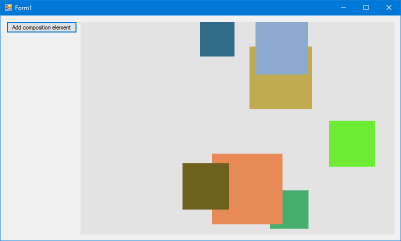

# Windows Forms HelloComposition sample

This sample contains the code created in the [Using the Visual Layer with Windows Forms](https://docs.microsoft.com/windows/uwp/composition/using-the-visual-layer-with-windows-forms) tutorial. It's a simple user interface (UI) that demonstrates how to add Universal Windows Platform (UWP) [Visual Layer](https://docs.microsoft.com/windows/uwp/composition/visual-layer) content to a Windows Forms app.

The Visual Layer APIs provide a high performance, retained-mode API for graphics, effects, and animations. It's the recommended  replacement for DirectComposition in apps that run on Windows 10.

This sample demonstrates how to set up the interop code needed to use these APIs in a Windows Forms app.

## Features

This sample includes the following features:

- A Windows Forms host class that implements interop between Windows Forms and UWP Composition APIs.
- Use of PInvoke and COM interop to access additional platform APIs.
- Encapsulation of the Visual Layer content in a Windows Forms custom control.
- Simple use of Composition visuals, brushes, and animations.

## Run the sample

This sample requires:

- Visual Studio 2017 or later - [Get a free copy of Visual Studio](http://go.microsoft.com/fwlink/?LinkID=280676)
- .NET Framework 4.7.2 or later
- Windows 10 version 1803 or later
- Windows 10 SDK 17134 or later

## Code at a glance

### CompositionHost

The main feature of this sample is the **CompositionHost** class, which derives from [Control](https://docs.microsoft.com/dotnet/api/system.windows.forms.control) and contains the code to set up interop between Windows Forms and the UWP Visual Layer.

The [Create a custom control to manage interop](https://docs.microsoft.com/windows/uwp/composition/using-the-visual-layer-with-windows-forms#create-a-custom-control-to-manage-interop) section of the tutorial that accompanies this sample walks through the setup step-by-step. However, you can copy-and-paste the code into a Windows Forms project and use it as-is; none of the code in this file is specific to this sample (except the namespace).

### CompositionHostControl

The **CompositionHostControl** class demonstrates how to use a Windows Forms Control to package your Visual Layer content in a way that you can easily integrate with your UI.

See the [Create a custom control to host composition elements](https://docs.microsoft.com/windows/uwp/composition/using-the-visual-layer-with-windows-forms#create-a-custom-control-to-host-composition-elements) section of the tutorial for more info about creating a container for Visual Layer content and connecting it to a host element.

### Form1

In Form1, you can see how to add an instance of **CompositionHostControl** to your Windows Forms UI.

See the [Add the control to your form](https://docs.microsoft.com/windows/uwp/composition/using-the-visual-layer-with-windows-forms#add-the-control-to-your-form) section of the tutorial for more info.

## See also

For a more complete example that builds on this infrastructure, see the [Windows Forms Visual layer integration sample](https://github.com/Microsoft/Windows.UI.Composition-Win32-Samples/tree/master/dotnet/WinForms/VisualLayerIntegration).

- [Visual Layer documentation](https://docs.microsoft.com/windows/uwp/composition/visual-layer)
- [Windows.UI.Composition](https://docs.microsoft.com/uwp/api/windows.ui.composition)